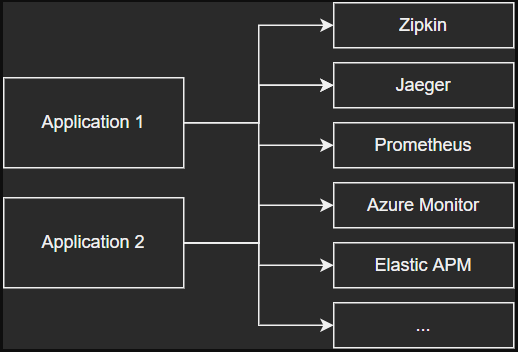
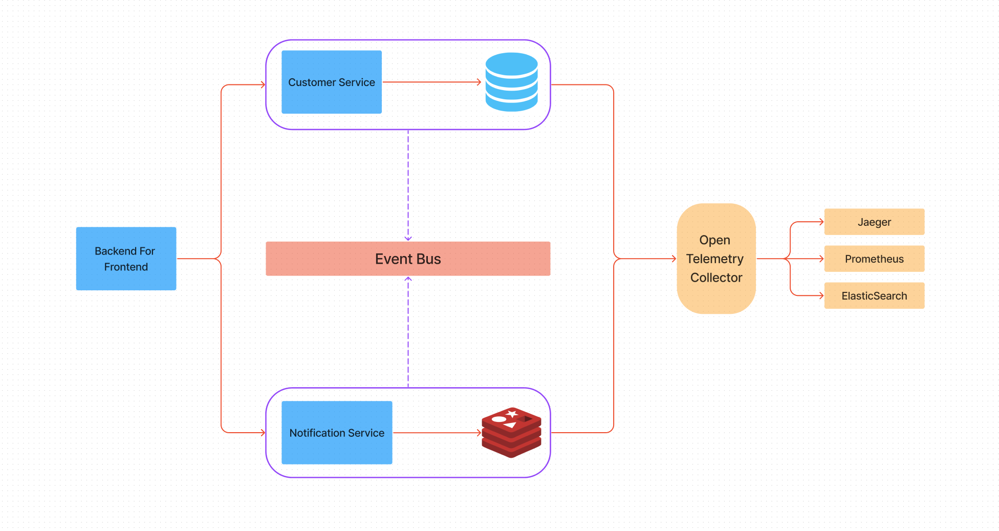

## What is Observability ?
Observability is the ability to measure a system’s current state based on the data it generates, such as logs, metrics, and traces.

## How can we make a system observable ?
There are a few concepts that we can implement to provide observability. 

 
 
### Logging
This is the concept that many software developers familiar with, These are structured or unstructured text records of events that occurred at a specific time. Logs should be reliable and descriptive.
 
### Tracing
Displays activity of a transaction or request as it flows through applications and shows how services connect, including code-level details.


### Metric
The values represented as counts or measures that are often calculated or aggregated over a period of time. Metrics can originate from a variety of sources, including infrastructure, hosts, services, cloud platforms, and external sources. </br></br><hr>


## What is Open Telemetry ?
OpenTelemetry is a set of APIs, SDKs, tooling and integrations that are designed for the creation and management of telemetry data such as traces, metrics, and logs. Provides vendor-agnostic implementation that can be configured to send telemetry data to the backends of your choice. Supports a variety of popular open-source projects including Jaeger and Prometheus. Also, a lot of vendors support OpenTelemetry directly or using the OpenTelemetry Collector. </br></br>


## Data Exporting with Open Telemetry
There are 2 different ways to export application data from Open Telemetry.

### 1. Exporter Modules
You can export the application data directly to the observability applications. To do this, you can use Open Telemetry exporter modules. You can see all the exporters from <a href=https://github.com/open-telemetry/opentelemetry-dotnet/tree/main/src>here</a>.

<p align="center">
 
</p></br>

### 2. Open Telemetry Collector
Open Telemetry Collector is an open source project that Open Telemetry provides. It works like a middleware application, and collects data from applications. Can be configure to export collected datas to observability applications.

 


## About Project

 </br></br>
This project has written on .NET 6, and has implementations of the observability concepts such as logging, tracing and metrics. Uses Open Telemetry auto instrumentations to collect application data and convert traces, metrics and logs.

 All the services we created connect Open Telemetry Collector application, and export its own data with Open Telemetry Protocol (OTLP). By this way, we have fully agnostic implementation, our services only depend on OTLP exportor module. Open Telemetry takes care of everything else,  collects data, and exports to observability applications. </br></br>

**Open Telemetry Collector;** 
- **Exports traces to Jaeger,**
- **Exports metrics to Prometheus,**
- **Exports logs to ElasticSearch.**

</br><hr>

## How to Run Project
This solution has docker support. Docker must be installed in the computer where you will run the project.
Then you must clone the repository and locate to the repository folder.

It is enough to run that commands to run the project.


**```cd src```**<p></p>
**```docker-compose --f docker-compose.yaml build```**<p></p>
**```docker-compose --f docker-compose.override.yaml up```**

</br>

- **you can go **http://localhost:8001/swagger/index.html** to reach Backend for Frontend project Swagger UI, and you can make requests.** 
- **you can go **http://localhost:16686/search** to reach Jaeger UI, and you can list the traces.**
- **you can go **http://localhost:9090/** to reach Prometheus UI, and you can monitor the application metrics.**
- **you can go **http://localhost:5601/** to reach Kibana UI. You can create an index pattern with "logs-generic-default" name, and list the application logs.**
